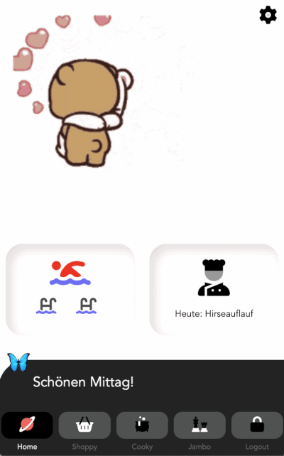

# shoppy

This app was a long time wish of my wife.

🛒 **Draggable Shopping List** with Firebase Realtime data synchronization.

🍽 **Cooky calendar**, to save the meals, we will cook in the future.
For the calendar I did not use a library, built it myself, quite a nice, interesting task.

📲 Used the Composition API to write and use a [Composition Function](https://github.com/LPF33/shoppy/blob/master/src/composables/useDetectSwipe.js) for detecting the Swipe-Direction to switch to the previous or next month.

💰 **Budget**, track all expenses and get a chart bar for monthly expenses

🎲 Jambo-Component: Just a simple Counter for a board game, we play usually. I'm too lazy to always turn over the game tiles to count each turn. So this app makes my life easier.

## Tech Stack

- Vue
- TypeScript
- Firebase (Auth & Database)
- Vuex
- Vue Router
- Composition API
- [Vue Test Utils](https://vue-test-utils.vuejs.org/)
- PWA
- Highcharts



## Project setup

Download app, create Firebase project with Authentication and a Firestore Database.
Add firebase config.js file under src folder to project, file exports:\
[x] firebase.firestore()\
[x] firebase.authFirebase()

[Firebase documentation](https://firebase.google.com/docs/build)

```
npm install
firebase login
firebase init
```

##### Compiles and hot-reloads for development

```
npm run serve
```

##### Compiles and minifies for production and deploy with Firebase

```
npm run build
firebase deploy
```
